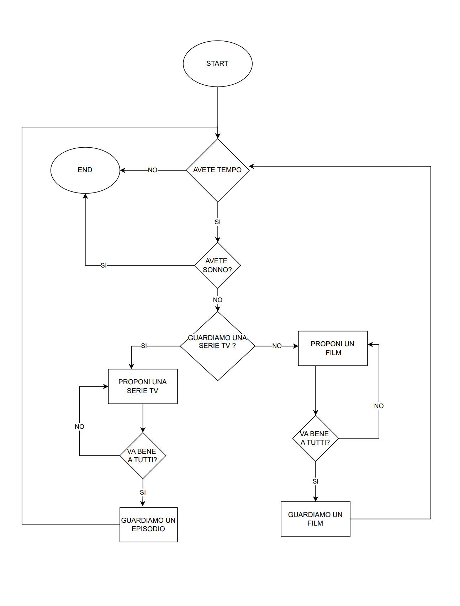

# **Netflix**

## **Descrizione**
Perché ci si mette sempre un’ora a scegliere cosa guardare la sera? Certo è difficile mettere d’accordo i gusti di tutti, poi dipende anche in base al tempo (o al sonno) che abbiamo. Delle volte si pensa di vedere quel bel film che ci hanno consigliato, mentre altre volte si viene risucchiati da quella serie tv che ci tiene incollati allo schermo. Che senso di vuoto quando poi finisce!

 

## **Diagramma di flusso**

 

## **Readme.md**
- START
- **SE NON** abbiamo tempo **O** abbiamo sonno
    - END
- **ALTRIMENTI**
    - **SE** vogliamo guardare una serie-tv
        - propongo una serie-tv
        - **SE NON** va bene a tutti
            - torno a _"propongo una serie-tv"_
        - guardiamo un episodio
    - **ALTRIMENTI**
        - propongo un film
        - **SE NON** va bene a tutti
            - torno a _"propongo un film"_
        - guardiamo un film
    - torno a _"START"_
